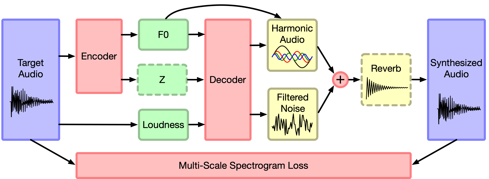

# Capstone3 Proposals:
## Audio Style Transfer with DDSP:
### Data, Sources:
```bibtex
@inproceedings{
  engel2020ddsp,
  title={DDSP: Differentiable Digital Signal Processing},
  author={Jesse Engel and Lamtharn (Hanoi) Hantrakul and Chenjie Gu and Adam Roberts},
  booktitle={International Conference on Learning Representations},
  year={2020},
  url={https://openreview.net/forum?id=B1x1ma4tDr}
}
```

### Abstract:
  Neural networks (such as WaveNet or GANSynth) can adapt to different datasets but often overfit details of the dataset and are difficult to interpret. Interpretable models (such as musical grammars) use known structure, so they are easier to understand, but have trouble adapting to diverse datasets. DSP (Digital Signal Processing) is one of the backbones of modern society, integral to telecommunications, transportation, audio, and many medical technologies. An incredible amont of knowledge resides in this domain, as the result of many years of research. When approaching audio-based machine learning tasks, it would be shortsighted to take this knowledge for granted.
  
  Whereas WaveNet and other neural audio synthesis models generate waveforms one sample at a time, DDSP passes parameters through known sound synthesis algorithms. we can use simple interpretable DSP elements to create complex realistic signals by precisely controlling their many parameters. For example, a collection of linear filters and sinusoidal oscillators (DSP elements) can create the sound of a realistic violin if the frequencies and responses are tuned in just the right way. However, it is difficult to dynamically control all of these parameters by hand, which is why synthesizers with simple controls often sound unnatural and “synthetic”. 
  
  With DDSP, we use a neural network to convert a user’s input into complex DSP controls that can produce more realistic signals. This input could be any form of control signal, including features extracted from audio itself. Since the DDSP units are differentiable, we can then train the neural network to adapt to a dataset through standard backpropagation.
### Deployment:
## Audio Style Transfer with DDSP:
### Data, Sources:
### Abstract:
### Deployment:
## Audio Style Transfer with DDSP:
### Data, Sources:
### Abstract:
### Deployment:
